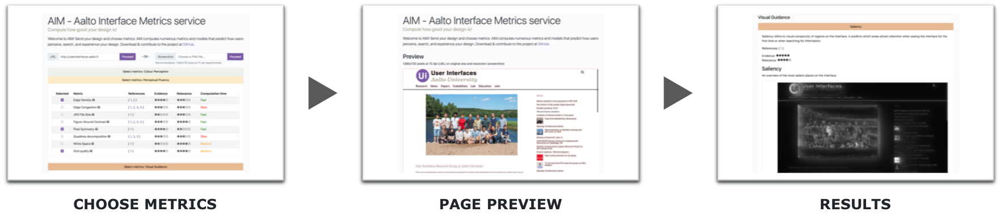

# Aalto Interface Metrics (AIM)

**Aalto Interface Metrics (AIM)** is a new service that lets you automatically test the usability and aesthetics of your website using several verified user interface metrics. Simply enter a web page URL or upload a screenshot, and select desired metrics to get started. AIM segments the page, and displays a preview. As results are computed, they are presented along with detailed explanations, and histograms for comparison. AIM is fully open-sourced, and we invite you to extend the service with your own contributions. Head over to [interfacemetrics.aalto.fi](https://interfacemetrics.aalto.fi/) to give it a try, and for more information.


## Architecture

AIM codebase is divided into three distinct parts:

* [Backend - web application](./backend/)
* [Frontend - web application](./frontend/)
* [Legacy - miscellaneous files](./legacy/)

The backend is written in Python using the [Tornado](http://www.tornadoweb.org/) web application framework having [MongoDB](https://www.mongodb.com/) as a database, whereas the frontend is built with [Vue.js](https://vuejs.org/). The backend and the frontend communicate with each other in real-time via [WebSocket](https://tools.ietf.org/html/rfc6455). The legacy folder contains miscellaneous files of AIM version 1 that have not been integrated into the new AIM version yet.

The most important files and folders in the AIM codebase are:
```
.
├── backend               : AIM backend files
│   ├── aim               : Source code (incl. metrics)
│   ├── data              : Data files (incl. datasets)
│   ├── tests             : Unit tests
│   ├── evaluator.py      : Evaluator utility app
│   ├── screenshoter.py   : Screenshoter utility app
│   └── server.py         : Server app
├── frontend              : AIM frontend files
│   ├── build             : Build scripts
│   ├── src               : Sources code (incl. assets)
│   ├── static            : Static files
│   ├── test              : Unit tests, etc.
│   └── config.js         : Configuration module
├── legacy                : AIM legacy files (version 1)
├── scripts               : AIM utility scripts
├── .env(.example)        : AIM environment variables
├── docker-compose.yml    : AIM environment and services
├── metrics.json          : AIM metrics configuration file
├── ...
.
```


## Download Large Models

Some AIM metrics (e.g., `m9`) include models that are large in size and cloning the repository will *not* download them correctly. To download the models, install [Git Large File Storage](https://github.com/git-lfs/git-lfs) and run the following commands.
```sh
git lfs install
git lfs pull
```


## Quick Start with Docker

The easiest and fastest way to get AIM up and running on your computer is by using [Docker](https://docs.docker.com/get-docker/) and following the instructions below.

### Prerequisites

1. [Docker Engine](https://docs.docker.com/engine/)
2. [Docker Compose](https://docs.docker.com/compose/)

### Configuration

Go to the [project home](./) directory and copy the `.env.example` to a `.env` file:
```sh
cp .env.example .env
```

Then, configure AIM environment variables, if needed:
```sh
nano .env
```

### Usage

AIM uses Docker Compose (see `docker-compose.yml`) to define its environment and services. The services consist of AIM backend (`backend`) and AIM frontend (`frontend`) as well as [MongoDB](https://www.mongodb.com/) (`mongo`) and [Mongo Express](https://github.com/mongo-express/mongo-express) (`mongo-express`). The latter is a web application for managing the MongoDB database, and it can be accessed at [http://localhost:8081](http://localhost:8081).

To build and start the services (i.e., the entire AIM web application), run:
```sh
# Note: The --build option can be omitted on subsequent runs
docker-compose up --build
```

Upon completion, you can start using the AIM web application by opening your web browser and navigating to [http://localhost:8080](http://localhost:8080).

The setup also supports smooth frontend and backend development, as it uses bind mounts to most essential source files. However, some actions such as installing new dependencies might require rebuilding the images (with the same command as above).

To stop the services, just hit `Ctrl+C`. You can also stop services by their ID as follows:
```sh
# List all running containers
docker container ls
# Stop a specific container by its ID
docker container stop <ID>
```


## Installation

AIM can also be installed and run without Docker. While this installation process requires some additional effort, it may work better for some practitioners. Moreover, it offers additional utility apps and tools that ain't currently available in docker mode.

### Prerequisites

Make sure you have the following software already installed on your computer before proceeding!

The backend dependencies include [Python 3.7](https://www.python.org/), [pip](https://pypi.org/project/pip/), [MongoDB](https://www.mongodb.com/), and [Chrome](https://www.google.com/chrome/). In addition, it is highly recommended to install [Miniconda](https://docs.conda.io/en/latest/miniconda.html) to create a dedicated Python virtual environment (see [instructions](#installation_backend)). Other dependencies include [Node.js 16.14.2](https://nodejs.org/) and [npm](https://www.npmjs.com/) for the frontend and [git](https://git-scm.com/) to track changes made to the codebase.

### Configuration

Go to the [project home](./) directory and copy the `.env.example` to a `.env` file:
```sh
cp .env.example .env
```

Then, configure AIM environment variables, if needed:
```sh
nano .env
```

The variables of interest (with default values) are as follows:
```
# General
COMPOSE_PROJECT_NAME=aim

# Frontend-specific variables
NODE_ENV=development
FRONTEND_PORT=8080
WS_URL=ws://localhost:8888/ws
AUTO_OPEN_BROWSER=false

# Backend-specific variables
ENVIRONMENT=development
NAME=aim-dev
PORT=8888
DATA_INPUTS_DIR=data/webapp/inputs/
DATA_RESULTS_DIR=data/webapp/results/
DB_USER=root
DB_PASS=example
DB_HOST=mongo
DB_PORT=27017
DB_NAME=aim
```

### Database

Create a new database called `$DB_NAME` (see the AIM environment variables above) in [MongoDB](https://www.mongodb.com/) with the following three collections in it: `errors`, `inputs`, and `results`. Further, create a new user called `$DB_USER` with a password `$DB_PASS` in the `admin` database, or use the user credentials of an existing one. You also have to change `$DB_HOST` and `$DB_PORT` to match the host (e.g., `localhost`) and port (e.g., `27017`) used by your MonggoDB, respectively.

**Note:** AIM backend will attempt to authenticate the user to the `admin` database in MongoDB (for details, see [authSource](https://docs.mongodb.com/manual/reference/connection-string/#mongodb-urioption-urioption.authSource)). Therefore, make sure that your `$DB_USER` exists in the `admin` database (not in your `$DB_NAME`) and it has appropriate roles (e.g., `readWrite`) on your `$DB_NAME` database.

### Backend <a name="installation_backend"></a>

AIM backend uses [Selenium](https://selenium-python.readthedocs.io/) to take screenshots of web pages. Our Selenium code, in turn, depends on [Chrome](https://www.google.com/chrome/) and a *matching* version of [ChromeDriver](https://chromedriver.chromium.org/), of which the latter needs to be placed into the `./backend/webdrivers` folder. For Linux and macOS, we provide a [script](./scripts/get_webdrivers.sh) that automatically downloads a *matching* version of ChromeDriver and places it into the above-mentioned folder. To execute the script, run:
```sh
bash ./scripts/get_webdrivers.sh
```

Alternatively, on Windows, you need to manually download a *matching* version of ChromeDriver and place it into the above-mentioned folder. For more instructions or what the necessary steps are, please check the comments in the [script](./scripts/get_webdrivers.sh) file.

In the next step, we will create a new Python virtual environment (recommended) for the backend. Before proceeding, go to the [backend](./backend/) directory.

#### Working with `Miniconda`

Create a new virtual environment:
```sh
conda create -n aim2 python=3.7
```

Activate the virtual environment:
```sh
conda activate aim2
```

Install all dependencies, including development packages:
```sh
pip install -r requirements.txt
```

To deactivate the virtual environment, run:
```sh
conda deactivate
```

### Frontend

Go to the [frontend](./frontend/) directory and install the dependencies by running:
```
npm install
```


## Usage

### Backend

To start the backend server, go to the [backend](./backend/) directory and run:
```sh
python server.py
```

### Frontend

To start the frontend HTTP server in development mode, go to the [frontend](./frontend/) directory and run:
```sh
npm run dev
```

To build the frontend for production, run the following command in the same directory:
```sh
npm run build
```

After the build is complete, the files (for production) can be found under the newly created `dist` directory. These files are meant to be served over an HTTP server, such as [Apache HTTP Server](https://httpd.apache.org/).

It is highly recommended to use a *load balancer* (e.g., Apache HTTP Server) in a production environment, as certain metrics are extremely CPU intensive. This means that the backend needs to be launched with multiple instances, each listening to a different port. A process manager (e.g., [pm2](http://pm2.keymetrics.io/)) will come in handy at that point.


## Tests <a name="tests"></a>

AIM backend uses [pytest](https://pypi.org/project/pytest/), a Python testing framework, to run tests on the backend source code, including metrics. To configure and run the tests, go to the [backend](./backend/) directory and follow the instructions below.

### Configuration

Configure pytest, if needed:
```sh
nano pytest.ini
```

### Usage

Run all tests:
```sh
pytest .
```

Run a specific test file:
```sh
pytest [FILEPATH]
```


## Screenshoter App <a name="screenshoter"></a>

AIM backend provides a utility app for taking web page screenshots in specified dimensions (i.e., width, height, and/or full page). To configure and run the app, go to the [backend](./backend/) directory and follow the instructions below.

### Configuration

Configure [Loguru](https://pypi.org/project/loguru/), if needed:
```sh
nano loguru.ini
```

### Usage

Show the help message:
```sh
python screenshoter.py -h
```

Example of taking web page screenshots:
```sh
python screenshoter.py -i data/screenshots/ALEXA_500/urls.csv -sw 1280 -sh 800 -f -o data/screenshots/results/
```


## Evaluator App <a name="evaluator"></a>

AIM backend also provides a utility app for evaluating GUI designs (i.e., web page screenshots) against selected metrics. The app generates two files: `results.csv` and `quantiles.csv`. Tthe former file contains evaluation results, while the latter file contains statistics. In addition, it also generates `<YOUR_METRIC_ID>_results.json` files and optional histogram figures for each metric. To configure and run the app, go to the [backend](./backend/) directory and follow the instructions below.

### Configuration

Configure [Loguru](https://pypi.org/project/loguru/), if needed:
```sh
nano loguru.ini
```

### Datasets

[Alexa Top Global Sites](https://www.alexa.com/topsites) (ALEXA_500) currently serves as our test dataset. Additional datasets can be downloaded, for instance, from https://doi.org/10.7910/DVN/XEYNYW.

### Usage

Show the help message:
```sh
python evaluator.py -h
```

Example of evaluating GUI designs:
```sh
python evaluator.py -i data/screenshots/ALEXA_500/ -m m1,m2,m3 -p -o data/evaluations/results/
```

**Note:** A set of screenshots in the input directory can be excluded from the evaluation by listing their file names in the `exclude.txt` file.


## Utility Tools <a name="tools"></a>

In addition, AIM backend supports the following utility tools to (i) ease development and (ii) unify and improve code quality. Their installation and use is optional, but highly recommended.

- **isort.** Python utility to automatically sort imports. https://pypi.org/project/isort/
- **Black.** Python code formatter. https://pypi.org/project/black/
- **Mypy.** Static type checker for Python. https://pypi.org/project/mypy/
- **Flake8.** Python tool for style guide enforcement. https://pypi.org/project/flake8/

### Installation

Go to the [backend](./backend/) directory. No additional installation is needed.

### Configuration

Configure isort, if needed:
```sh
nano .isort.cfg
```

Configure Black, if needed:
```sh
nano pyproject.toml
```

Configure mypy, if needed:
```sh
nano mypy.ini
```

Configure flake8, if needed:
```sh
nano .flake8
```

### Usage

Sort imports:
```sh
isort .
```

Format code:
```sh
black .
```

Type check code:
```sh
mypy .
```

Lint code:
```sh
flake8 .
```


## Pre-Commit <a name="pre-commit"></a>

Git hook scripts for AIM backend that are automatically run on every commit to point out issues in code such as missing semicolons, trailing whitespace, and debug statements. Its installation and use is optional, but highly recommended.

- **pre-commit.** Package manager for pre-commit hooks. https://pypi.org/project/pre-commit/

### Installation

Go to the [project home](./) directory and install pre-commit into your git hooks:
```sh
pre-commit install --install-hooks --overwrite
```

To uninstall pre-commit from your git hooks, run:
```sh
pre-commit uninstall
```

### Configuration

Configure pre-commit, if needed:
```sh
nano .pre-commit-config.yaml
```

### Usage

Run all pre-commit hooks against currently staged files:
```sh
pre-commit run
```

Run a single pre-commit hook against currently staged files:
```sh
pre-commit run [HOOK ID]
```

Run all pre-commit hooks against all files:
```sh
pre-commit run --all-files
```

Run all pre-commit hooks against specific files:
```sh
pre-commit run --files [FILES [FILES ...]]
```


## Troubleshooting

1. **PROBLEM:** Running `mypy` fails and the following error message is shown *./venv/lib/python3.7/site-packages is in the PYTHONPATH. Please change directory so it is not.* **SOLUTION:** Create your virtual environment outside of the AIM backend directory. For example, `virtualenv ../venv`. Alternatively, configure mypy to exclude your virtual environment directory.
2. **PROBLEM:** Running `mypy` finds errors in files that are not part of the AIM backend. For example, *venv/bin/activate_this.py:28: error: "str" has no attribute "decode"; maybe "encode"?* **SOLUTION:** Create your virtual environment outside of the AIM backend directory. For example, `virtualenv ../venv`. Alternatively, configure mypy to exclude your virtual environment directory.
3. **PROBLEM:** Running `python screenshoter.py` or submitting an URL in the web application fails and an error message similar to the following is shown *selenium.common.exceptions.SessionNotCreatedException: Message: session not created: This version of ChromeDriver only supports Chrome version 89. Current browser version is 91.0.4472.77 with binary path /Applications/Google Chrome.app/Contents/MacOS/Google Chrome* **SOLUTION:** Download a matching version of [ChromeDriver](https://chromedriver.chromium.org/downloads) and replace the appropriate `chromedriver_xxx` file in the [webdrivers](./backend/webdrivers/) directory.


## Contributing

Please read [CONTRIBUTING.md](./CONTRIBUTING.md) for details on contributing to AIM.


## Changelog

Detailed changes for each release are documented in the [release notes](https://github.com/aalto-ui/aim/releases).


## Funding Information and Contact

AIM and related research have been funded by the Technology Industries of Finland Future Makers project SOWP (2017-2019) and the European Research Council starting grant (COMPUTED 2015-2020).

For questions and further information, please contact us via email at <interfacemetrics@aalto.fi>.


## License

Copyright (c) 2018-present, [User Interfaces group](https://userinterfaces.aalto.fi/), [Aalto University](https://www.aalto.fi/), Finland

This software is distributed under the terms of the [MIT License](https://opensource.org/licenses/MIT). See [LICENSE.txt](./LICENSE.txt) for details.
