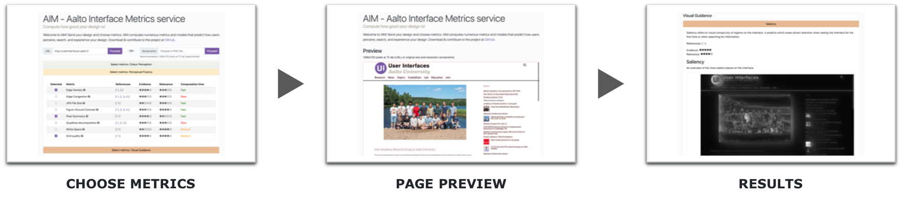

# AIM – Aalto Interface Metrics

AIM is an online service and an open code repository for *computational evaluation* of graphical user interface (GUI) designs. AIM pools several previously published metrics and models, which have been empirically shown to be predictive of how users perceive, search, and aesthetically experience a  design. These metrics range from design heuristics like symmetry to metrics and full-fledged models, such as saliency and visual clutter.

More information on AIM can be found in the [paper](./aim_frontend/static/publications/oulasvirta_et_al_2018.pdf) published in [UIST'18](http://uist.acm.org/uist2018/).


## Architecture and Technologies

AIM's codebase is divided into four distinct parts:

* [Frontend - web application](./aim_frontend/)
* [Backend - web application](./aim_backend/)
* [Metrics library](./aim_metrics/)
* [Segmentation script](./aim_segmentation/)

The web application's frontend is built with [Vue.js](https://vuejs.org/), whereas the backend is based on [Tornado](http://www.tornadoweb.org/). The frontend and the backend communicate with each other via [WebSocket](https://tools.ietf.org/html/rfc6455).

### Depencencies

The metrics library and the segmentation script are both dependencies for the web application's backend. Other dependencies include [Node.js](https://nodejs.org/) + [npm](https://www.npmjs.com/) (frontend), [Python 2.7](https://www.python.org/) + [pip](https://pypi.org/project/pip/) (backend), and [MongoDB](https://www.mongodb.com/) (database). In addition, the backend depends on [Headless Chrome](https://www.google.com/chrome/) and [layout-learning](./aim_backend/bin/layout-learning). The former is used to capture web page screenshots and the latter offers an implementation for the visual search performance metric (needs to be compiled under the target platform, only Linux is available for now).


## Installation

### Frontend

Start by configuring frontend environment variables for [development](./aim_frontend/config/dev.env.js), [test](./aim_frontend/config/test.env.js), and [production](./aim_frontend/config/prod.env.js). Then, go to the [aim_frontend](./aim_frontend/) directory and run the following command:

```bash
# Install required packages
npm install
```

### Backend

Configure backend environment variables for [development](./aim_backend/configs/development.conf), [test](./aim_backend/configs/test.conf), and [production](./aim_backend/configs/productions.conf). Next, go to the [aim_backend](./aim_backend/) directory, and create and activate a new Python virtual environment (if needed). Run the following commands:

```bash
# Install required packages
pip install ../aim_metrics
pip install ../aim_segmentation
pip install -r requirements.txt
pip install opencv-python
```

### Database

Create `aim` database in MongoDB with the following two collections under it: `screenshots` and `results`.


## Usage

### Frontend

Go to the [aim_frontend](./aim_frontend/) directory first, and then run the following command:

```bash
# Serve with hot reload at localhost:8080
npm run dev
```
To build the frontend for production:

```bash
# Build for production with minification
npm run build
```

After the build is complete, the files (for production) can be found under the *dist* directory. These files are meant to be served over an HTTP server, such as [Apache HTTP Server](https://httpd.apache.org/).

### Backend

To run the backend server, go the [aim_backend](./aim_backend/) directory and execute:

```bash
# Start the server
python uimetrics_backend/main.py
```

It is highly recommended to use a load balancer in a production environment, as certain metrics are extremely CPU intensive. This means that the backend needs to be launched with multiple instances, each listening to a different port. A process manager (e.g., [pm2](http://pm2.keymetrics.io/)) will come in handy at that point. Also, define the AIM_ENV environment variable on the production server and set its value to "production" (defaults to "development").


## Contributing

Please read [CONTRIBUTING.md](./CONTRIBUTING.md) for details on contributing to AIM.


## Changelog

Detailed changes for each release are documented in the [release notes](https://github.com/aalto-ui/aim/releases).


## Contact

For questions and further information, please contact us via email at <interfacemetrics@aalto.fi>.


## License

This project is licensed under the [MIT License](https://opensource.org/licenses/MIT), see the [LICENSE.txt](./LICENSE.txt) file for details.

Copyright © 2018 [User Interfaces group](https://userinterfaces.aalto.fi/), [Aalto University](https://www.aalto.fi/), Finland